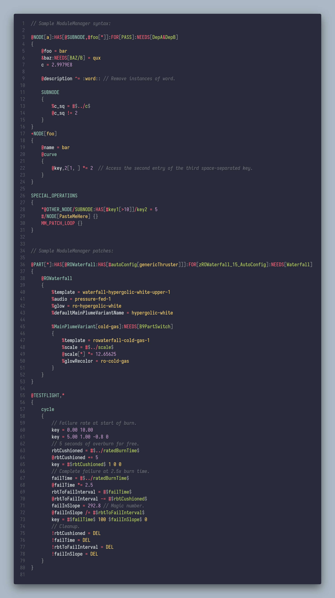

# KSP Config Support

Provides support for [Kerbal Space Program](https://kerbalspaceprogram.com) configuration files.

## Supported Features

* Syntax highlighting for KSP `.cfg`, `.craft`, `.sfs`, and `.ConfigCache` files
* Full [ModuleManager](https://github.com/sarbian/ModuleManager) syntax support

## Known issues

* None
